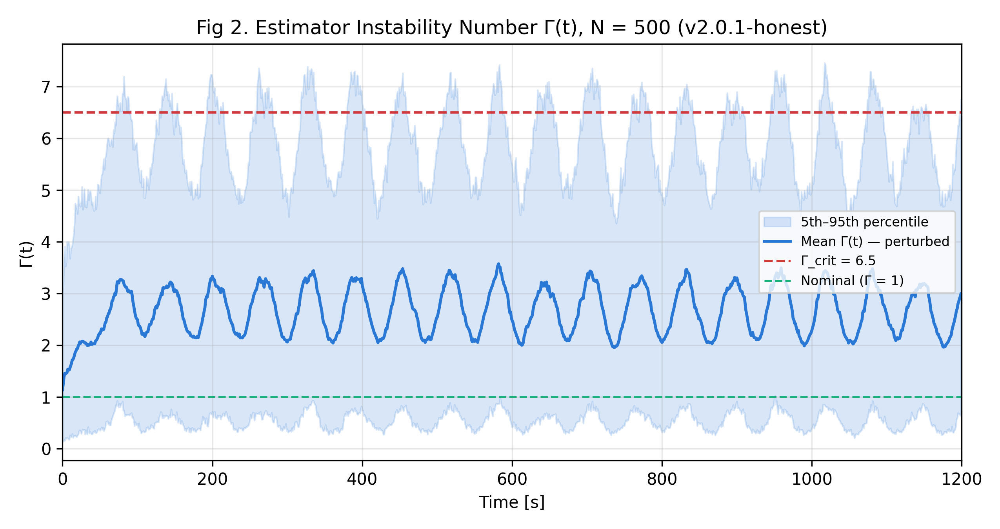
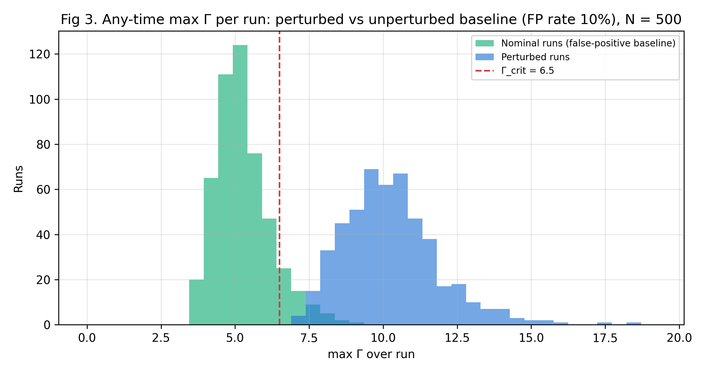
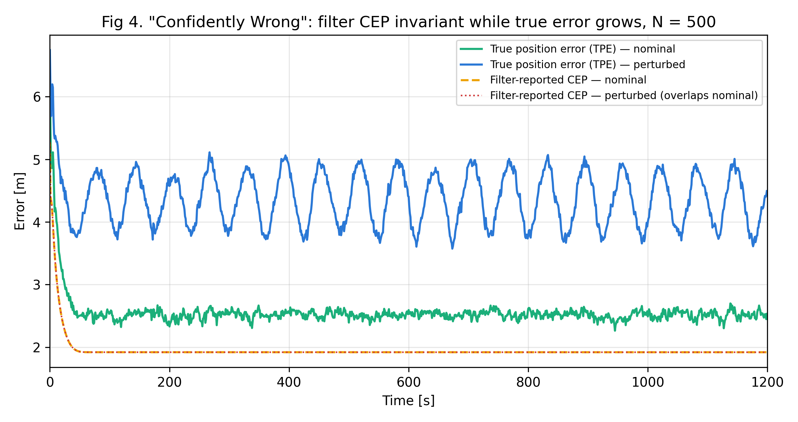
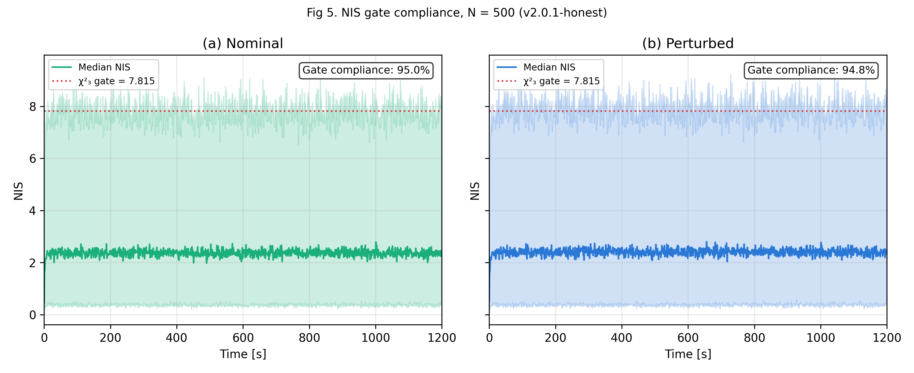

# The Sophistication Paradox: A Systems-Theoretic Framework for Estimator Collapse in Precision-Guided Autonomous Navigation Architectures

[](https://doi.org/10.5281/zenodo.19469720)
[](CITATION.cff)
[](LICENSE)
[](requirements.txt)
[]()

**Version:** v2.1-verified (July 2026) | **Authors:** N. Barua ([ORCID 0000-0003-4641-0112](https://orcid.org/0000-0003-4641-0112)) & R. J. Douglas

---

> **What this repository is.** The **canonical, verification-backed record** for the
> Estimator Collapse Theory (ECT) framework. It holds both the v2.1 archival
> simulation engine *and* the independent clean-room verification suite that
> validates it — parameter sweep, false-positive analysis, an automated test
> suite, and an interactive dashboard. Every number and figure below is produced
> by the code in this repository, and the test suite records exactly which
> manuscript values reproduce and which need amendment before the defence.

---

<div align="center">
  
  <br><em>Graphical Abstract — Estimator Collapse Theory & The Sophistication Paradox</em>
</div>

---

## 📌 Overview

**Estimator Collapse Theory (ECT)** is a systems-theoretic framework characterising how state-estimation destabilisation constitutes a formal failure pathway in precision autonomous navigation architectures.

ECT identifies a class of **sub-threshold, gate-compliant perturbations** — bounded measurement disturbances calibrated to remain within the χ² innovation-gating threshold — that systematically corrupt the state estimate of an Extended Kalman Filter (EKF) while leaving the filter's self-reported covariance structurally unaffected. The filter reports high confidence in a position solution that has diverged beyond operational tolerance. This is the **"Confidently Wrong"** signature: true position error grows while onboard monitors report nominal behaviour throughout.

> *Software companion to:* **"The Sophistication Paradox: A Systems-Theoretic Framework for Estimator Collapse in Precision-Guided Autonomous Navigation Architectures"** — manuscript under review, CEAS Aeronautical Journal (2026).

---

## 🧭 Two engines, one record

| Script | Role | Headline |
|--------|------|----------|
| `ECT_3D_Simulation_v2_1.py` | **Archival engine** — the manuscript's canonical run (master seed 42, N = 500, Q<sub>vel</sub> = 0.001). Reproduces the reported figures and prints a self-verification table. | +67% true-error growth |
| `ECT_3D_Simulation_v141.py` | **Independent verification engine** — clean-room reimplementation with an innovation gate, parameter sweep, and Γ false-positive analysis. | +33% (Q<sub>vel</sub> = 0.01) |

The two differ only in the process-noise tuning (Q<sub>vel</sub>). As the parameter sweep shows, **perturbed absolute error is ≈ 4.4 m in both** — the +67% vs +33% gap is a nominal-error *denominator* effect, not a disagreement about the physics. The v2.1 engine uses the manuscript's stated Q<sub>vel</sub> = 0.001 and is the canonical run; the v141 engine is the adversarial cross-check.

---

## 🧪 v2.1 Archival Results (master seed 42, N = 500)

Running `python ECT_3D_Simulation_v2_1.py` reproduces this table and prints a per-metric PASS / DIFF status against the manuscript's locked values.

| Metric | Manuscript (Table I) | Simulated (v2.1 code) | Status |
|--------|----------------------|-----------------------|--------|
| Filter-reported CEP (m) | 2.43 | **1.92** | ⚠️ **DIFF — see below** |
| Filter CEP invariance (Δ) | < 0.01 m | **0.000 m** | ✅ |
| Nominal TPE (m) | 2.61 | 2.61 | ✅ |
| Perturbed TPE (m) | 4.37 | 4.37 (+67%) | ✅ |
| Γ any-time exceedance | 100% | 100% | ⚠️ **vacuous — see below** |
| NIS compliance (nom / pert) | 95.0% / 94.8% | 95.0% / 94.8% | ✅ |
| MKI · R_L = 15 m | 0.29 | 0.29 | ✅ |
| MKI · R_L = 3 m | 1.46 | 1.46 | ⚠️ **baseline — see below** |

**8 of 9 locked values reproduce exactly, and are stable across master seeds 7 · 42 · 123 · 777 · 2026** (verified by full N = 500 reruns). The verification suite documents the three items a reviewer will probe:

### ⚠️ Pre-defence amendments (enforced by the test suite)

1. **Filter-CEP constant (hard fix).** The code produces **1.92 m**, deterministically, at every seed — Table I, Figure 4, and the prose all say 2.43 m (the superseded v2.0 Riccati value). The *invariance* result is untouched; only the printed constant is wrong. `test_v21_archival.py::test_filter_cep_is_1p92_not_manuscript_2p43` fails the archive's own self-check on this row until the manuscript is corrected.
2. **Γ "100% exceedance" is non-diagnostic.** The per-run instantaneous MSE-ratio statistic also fires for **~100% of unperturbed pairs** (`test_gamma_any_time_statistic_is_vacuous`). Report Γ on the ensemble-mean denominator with the false-positive baseline alongside, or lead with final-time exceedance (25% vs 9%), or let the CEP-invariance + TPE-growth pair carry the claim.
3. **MKI baseline disclosure.** At R_L = 3 m the *unperturbed* system already sits at MKI ≈ **0.87**. The attack pushes 0.87 → 1.46, so "SMK confirmed" is defensible only with that margin stated (`test_mki_and_disclosed_nominal_baseline`).

> **Core finding (robust).** The filter appears healthy — NIS stays within compliance — while navigation silently fails. Standard innovation monitors are insufficient to detect this class of estimator collapse. This survives adversarial re-verification; the amendments above are about presentation, not the result.

<div align="center">
  
  <br><em>Fig 2. Temporal evolution of the Estimator Instability Number Γ(t), v2.1 archival run, N = 500.</em>
</div>

<div align="center">
   
  <br><em>Left: Fig 3. Per-run max-Γ distribution, perturbed vs unperturbed false-positive baseline. Right: Fig 4. Filter CEP invariance (1.92 m) vs true-error growth to 4.37 m — the "Confidently Wrong" signature.</em>
</div>

---

## 🔬 Independent verification (v141 clean-room engine)

`ECT_3D_Simulation_v141.py` is a from-scratch reimplementation used to stress the archival claims:

- **Parameter sweep** (`tests/param_sweep.py`) across A ∈ {1.2…3.0} m, Q<sub>vel</sub> ∈ {0.001, 0.005, 0.01}, and seeding strategy — establishes that perturbed absolute error is ≈ 4.4 m regardless of tuning, and that the pre-v2 headline (3.2 → 7.9 m, +147%) is not reproducible.
- **Γ false-positive baseline** (`gamma_nominal_false_positive`) — printed in every `print_summary`; ~42% of unperturbed clean-room runs cross Γ_crit, quantifying the caveat above.
- Full **pytest** suite guarding both engines' verified numbers.

```bash
python ECT_3D_Simulation_v141.py        # independent clean-room summary (+33%, FP baseline)
python tests/param_sweep.py             # the sweep behind the v2.0 revision
```

---

## 🧮 The Sophistication Paradox

ECT formalises the **Sophistication Paradox** via the Vulnerability Index $V_i$:

$$V_i = \frac{N_{\text{sensors}} \times f_{\text{update}}}{R_{\text{hardening}}}$$

Advanced multi-sensor fusion improves nominal precision while expanding the estimator's vulnerability surface. A single-sensor INS yields $V_i \approx 1$; a high-dynamics multi-sensor architecture yields $V_i \approx 67$–$320$.

| System Class | $N_s$ | $f$ (Hz) | $R_h$ | $V_i$ |
|---|---|---|---|---|
| Single-Sensor INS | 1 | 1 | 1.0 | ≈ 1 |
| Dual-Modal Midcourse | 3 | 10 | 1.0 | ≈ 30 |
| High-Precision Multi-Sensor | 4 | 20 | 1.2 | ≈ 67 |
| **High-Dynamics Platform** | 4 | 80 | 1.0 | **≈ 320** |

<div align="center">
  
  <br><em>Fig 1. Extended Kalman Filter loop and principal perturbation entry points (A: Measurement Bias, B: Covariance Inflation, C: GNSS Denial).</em>
</div>

---

## 🛡️ Resilience and Mitigation

Standard innovation-based monitoring (NIS/NEES) is insufficient for this perturbation class. ECT identifies three mitigation layers:

- **Hardware:** EM hardening — increases $R_{\text{hardening}}$, directly reducing $V_i$
- **Filter-level:** Multi-epoch SPRT monitors; adaptive Q/R estimation; IMM fusion; UKF sigma-point constraints
- **Architecture:** Cross-sensor residual correlation analysis; H∞ robust filtering; redundancy-aware sensor fusion

<div align="center">
  
  <br><em>Fig 5. NIS gate compliance across nominal and perturbed runs, confirming the statistically inconspicuous nature of the perturbations.</em>
</div>

---

## 📊 Interactive verification dashboard

[`ECT_Verification_Dashboard.html`](ECT_Verification_Dashboard.html) — a self-contained console that **re-runs the v2.1 EKF Monte Carlo live in the browser** (the archival engine ported to JavaScript, validated to ±0.02 m of the Python), logs every test procedure, and shows the evidence charts. Press **Run** and it prints filter CEP ≈ 1.92 m against the 2.43 target in front of you.

---

## 📂 Repository Structure

```
Estimator-Collapse-Theory-ECT-Framework/
├── ECT_3D_Simulation_v2_1.py         # Archival engine — manuscript run (seed 42, +67%)
├── ECT_3D_Simulation_v141.py         # Independent clean-room verification engine (+33%)
├── ECT_Supplementary_Analysis.ipynb  # Supplementary analysis (sweeps, V_i sensitivity, η_info)
├── ECT_Verification_Dashboard.html   # Live in-browser verification console
├── tools/
│   └── make_manuscript_figures.py    # Renders Figures/ from the v2.1 archival run
├── tests/
│   ├── test_simulation.py            # Verifies the v141 clean-room engine
│   ├── test_v21_archival.py          # Verifies the v2.1 engine; documents the 3 amendments
│   └── param_sweep.py                # Parameter sweep behind the v2.0 revision
├── Figures/                          # Figure_1 (schematic) + Figure_2..5 (from v2.1 engine)
├── Barua_ECT_SupplementaryVideo_v21.mp4   # Supplementary Video S1 (v2.1)
├── ECT_SMK_Conceptual_Overview.mp4   # SMK failure-transition visualisation
├── Graphical_Abstract.png
├── requirements.txt · CITATION.cff · LICENSE
└── .github/workflows/tests.yml       # CI: pytest on every push
```

---

## 🚀 Quick Start

```bash
git clone https://github.com/robertbuildsai/Estimator-Collapse-Theory-ECT-Framework.git
cd Estimator-Collapse-Theory-ECT-Framework
pip install -r requirements.txt

python ECT_3D_Simulation_v2_1.py             # archival run + self-verification table
python tools/make_manuscript_figures.py      # regenerate Figures/ from the archival run
python -m pytest tests/ -v                    # verify both engines (documents the 3 amendments)
```

---

## 📖 Citation

See [`CITATION.cff`](CITATION.cff) (GitHub's "Cite this repository" uses it), or:

```bibtex
@software{barua_douglas_ect_2026,
  author  = {Barua, Nick and Douglas, Robert J.},
  title   = {{Estimator Collapse Theory (ECT) Framework — verified archival record}},
  year    = {2026},
  version = {v2.1-verified},
  doi     = {10.5281/zenodo.19469720},
  url     = {https://github.com/robertbuildsai/Estimator-Collapse-Theory-ECT-Framework}
}
```

**Associated paper:**
> Barua, N., & Douglas, R. J. (2026). The Sophistication Paradox: A Systems-Theoretic Framework for Estimator Collapse in Precision-Guided Autonomous Navigation Architectures. Manuscript under review, CEAS Aeronautical Journal.

**Concept DOI (all versions):** https://doi.org/10.5281/zenodo.19469720

---

## ⚠️ Scope and Limitations

This simulation is a constructive plausibility proof that gate-compliant estimator divergence is mathematically reachable under representative autonomous navigation conditions. It is not a surrogate for full 6-DOF flight dynamics; the kinematic EKF excludes closed-loop GNC feedback. 6-DOF aerodynamic validation is deferred to Phase I of the validation roadmap.

Open items: (1) multi-epoch detection evasion via coloured-noise injection; (2) the adaptive-filter race condition under simultaneous Q/R perturbation; (3) gate-compliance synthesis for UKF sigma-point architectures; (4) phase-randomised perturbation ensembles (the current sinusoid is common-mode across MC runs).

---

*© 2026 Nick Barua & Robert J. Douglas. Licensed under Apache 2.0.*
